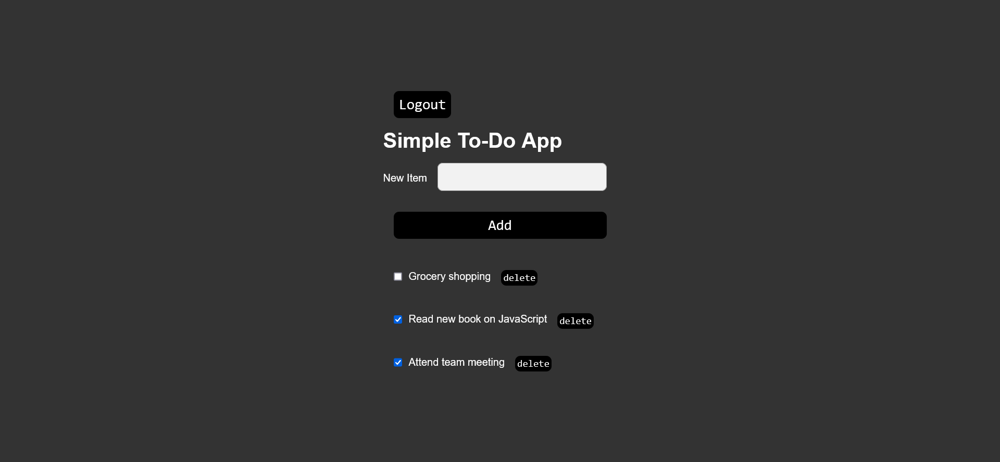

# Todo App

## Overview
This project is a Todo App built with React for the frontend and Node.js for the backend. The app allows users to register, login, and manage their todo tasks. The project demonstrates the use of various technologies and best practices for building a full-stack web application.




## Features
- User registration and authentication
- JWT-based secure authentication
- Create, read, update, and delete (CRUD) operations for todos
- Responsive user interface
- API integration with Axios
- MySQL database for data storage

## Technologies Used
- **Frontend:** React, JSX
- **Backend:** Node.js, Express
- **Database:** MySQL
- **HTTP Client:** Axios
- **Authentication:** JWT (JSON Web Tokens)
- **Styling:** CSS (or any specific library used, e.g., Material-UI, Bootstrap)

## Project Structure
- `index.js`: Main entry point for the backend server.
- `axios.js`: Configuration file for Axios HTTP client.
- `Register.jsx`: React component for user registration.
- `TodoPage.jsx`: React component for displaying and managing todos.
- `Login.jsx`: React component for user login.
- `Logout.jsx`: React component for user logout.
- `App.js`: Main React component that sets up routing and authentication.

## Getting Started

### Prerequisites
- Node.js (version X.X.X)
- npm (version X.X.X)
- MySQL (version X.X.X)

### Installation
1. Clone the repository:
    ```sh
    git clone https://github.com/yourusername/todo-app.git
    ```
2. Navigate to the project directory:
    ```sh
    cd todo-app
    ```
3. Install dependencies for both frontend and backend:
    ```sh
    npm install
    ```

### Environment Variables
Create a `.env` file in the root directory and add the following environment variables:

```dotenv
BACKEND_PORT=3500
ALLOWED_ORIGIN=http://localhost:5173
JWT_SECRET=your_jwt_secret
DB_HOST=your_database_host
DB_USER=your_database_user
DB_PASSWORD=your_database_password
DATABASE_NAME=your_database_name
```


### Running the Application
1. Start the backend server:
    ```sh
    node index.js
    ```
2. Navigate to the frontend directory and start the React app:
    ```sh
    cd frontend
    npm start
    ```
3. Open your browser and go to `http://localhost:3000`

## API Endpoints
- **POST** `/register`: Register a new user
- **POST** `/auth`: Authenticate a user
- **GET** `/todo`: Get all todos for the authenticated user
- **POST** `/todo`: Create a new todo
- **PUT** `/todo/:id`: Update a specific todo
- **DELETE** `/todo/:id`: Delete a specific todo

## Authentication
The app uses JSON Web Tokens (JWT) for securing user authentication. After a successful login, a JWT token is generated and sent to the client. This token is required for accessing protected routes such as creating, updating, or deleting todos. The token is stored in local storage and included in the headers of subsequent requests.

### Middleware
- `authenticateToken`: Middleware to verify the JWT token in incoming requests. It checks the token and if valid, allows access to the protected routes.


## Contributing
Contributions are welcome! Please follow these steps:
1. Fork the repository.
2. Create a new branch (`git checkout -b feature-branch`).
3. Make your changes.
4. Commit your changes (`git commit -m 'Add some feature'`).
5. Push to the branch (`git push origin feature-branch`).
6. Open a pull request.

## License
This project is licensed under the MIT License. See the `LICENSE` file for more details.

## Acknowledgements
- [React](https://reactjs.org/)
- [Node.js](https://nodejs.org/)
- [Axios](https://github.com/axios/axios)
- [MySQL](https://www.mysql.com/)
- [JWT](https://jwt.io/)